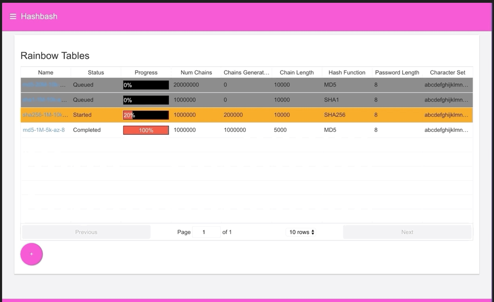

# Hash Bash Backend Go


### [View all Roadmaps](https://github.com/nholuongut/all-roadmaps) &nbsp;&middot;&nbsp; [Best Practices](https://github.com/nholuongut/all-roadmaps/blob/main/public/best-practices/) &nbsp;&middot;&nbsp; [Questions](https://www.linkedin.com/in/nholuong/)
<br/>



This project is a rewrite of the [hashbash-backend-java](https://github.com/nholuongut/hashbash-backend-java)
project I wrote a couple years ago. That project was itself a rewrite of a C++ implementation of rainbow tables that I
wrote in college.

The goal in writing the java version was both to implement a web interface around rainbow tables, providing a frontend
for viewing/searching them, and to implement the generation of rainbow tables using [spring batch](https://spring.io/projects/spring-batch).
The company I worked for at that time heavily used spring batch, java, and react and so writing that project was my
way of getting a deep-dive into all of those technologies.

This version of the project is a complete rewrite of the java version of the project in [go](https://golang.org). When
I wrote this, I was just learning go, and was really impressed by the performance and resource utilization of the
language. Rewriting the project in go gave me a way to do an apples to apples comparison of performance between identical
projects implemented in java and go respectively. As expected, the go version used a small fraction of the memory
used by the java version.

Aside from running this experiment, this rewrite was an excellent opportunity to get more familiarity with writing
complicated applications in go, as well as gaining experience using the following libraries:
* [gorilla web toolkit](https://www.gorillatoolkit.org)
* [gorm](https://gorm.io)
* [prometheus/client_golang](https://github.com/prometheus/client_golang)
* [amqp091-go](https://github.com/rabbitmq/amqp091-go)


### Building and Developing Locally
There is a docker-compose setup for running locally. To start run the following,
then navigate to http://localhost:23280 in your browser.
```
make run
```

To build the go binaries:
```
make
```

To build the docker images
```
make images
```

To run the application on your host machine, with rabbitmq and mysql in docker:
```
make run-deps
```

And finally, to publish the docker images to a docker registry:
```
make push
```

# 🚀 I'm are always open to your feedback.  Please contact as bellow information:
### [Contact ]
* [Name: Nho Luong]
* [Skype](luongutnho_skype)
* [Github](https://github.com/nholuongut/)
* [Linkedin](https://www.linkedin.com/in/nholuong/)
* [Email Address](luongutnho@hotmail.com)
* [PayPal.me](https://www.paypal.com/paypalme/nholuongut)


[](https://ko-fi.com/nholuong)

# License
* Nho Luong (c). All Rights Reserved.🌟
